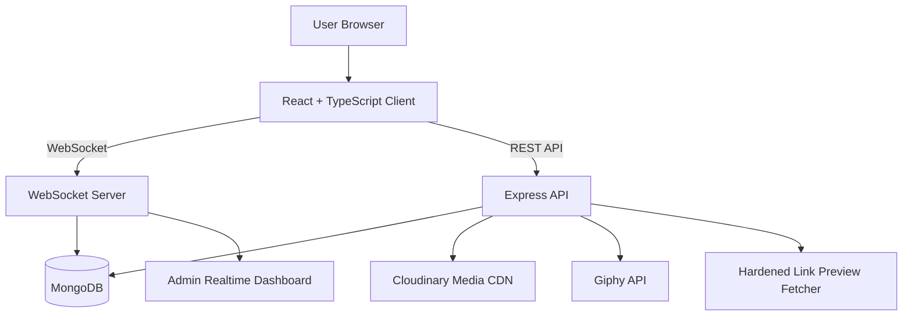

# Pulse Chat

> **A production-grade, real-time, scalable web messaging application engineered for high-fidelity conversations, dynamic multi-room routing, rich media exchange, secure moderation, and a premium responsive user experience.**

[](https://pulsechat.tech)
[](#technology-stack)
[](#technology-stack)
[](#realtime-architecture)
[](#technology-stack)

---

## Table of Contents

- [Overview](#overview)
- [Live Application](#live-application)
- [Core Capabilities](#core-capabilities)
- [Multi-Room Architecture](#multi-room-architecture)
- [Messaging Experience](#messaging-experience)
- [Reactions and Engagement](#reactions-and-engagement)
- [Media and File Pipeline](#media-and-file-pipeline)
- [Link Intelligence](#link-intelligence)
- [Security and Privacy](#security-and-privacy)
- [Moderation and Administration](#moderation-and-administration)
- [User Experience and Visual Design](#user-experience-and-visual-design)
- [Realtime Architecture](#realtime-architecture)
- [System Architecture](#system-architecture)
- [Technology Stack](#technology-stack)
- [Environment Configuration](#environment-configuration)
- [Local Development](#local-development)
- [Production Build](#production-build)
- [Project Structure](#project-structure)
- [Operational Notes](#operational-notes)
- [License](#license)

---

## Overview

**Pulse Chat** is a real-time scalable web messaging platform built for fast, reliable, and expressive digital communication. It combines persistent WebSocket messaging, secure REST services, MongoDB-backed persistence, Cloudinary-powered media delivery, hardened link preview handling, and a refined React interface optimized for desktop and mobile interaction.

The application is designed around five engineering priorities:

1. **Realtime reliability** — persistent WebSocket communication, heartbeat health checks, reconnection awareness, and ordered history delivery.
2. **Multi-room isolation** — dynamic routing, private aliases, distinct moderation boundaries, and secure joining mechanisms.
3. **Security-first interaction** — strict validation, ReDoS/NoSQL injection prevention, rate limiting, URL sanitation, and robust device fingerprinting.
4. **High-performance UI** — virtualized rendering, adaptive overscan, optimized media previews, lock-solid scrolling mechanics, and premium micro-interactions.
5. **Operational control** — admin telemetry, live audit streams, blocking workflows, invite controls, report intake, and message event history.

---

## Live Application

- **Production URL:** [https://pulsechat.tech](https://pulsechat.tech)
- **About the Developer:** [https://pulsechat.tech/about-developer](https://pulsechat.tech/about-developer)
- **Repository:** [https://github.com/2harshpandey/pulse-chat](https://github.com/2harshpandey/pulse-chat)

---

## Core Capabilities

Pulse Chat includes a complete real-time messaging foundation suitable for high-concurrency conversational workflows.

- Persistent multi-user WebSocket messaging with heartbeat `ping` / `pong` reliability checks.
- Instant join and leave system notifications broadcast to active participants.
- Unique username enforcement across both HTTP authentication and WebSocket connection layers.
- Session-aware reconnect handling to prevent false leave events during page refreshes.
- Persistent client identity using cryptographically strong locally stored user identifiers.
- Server-side user tracking with join history, last-seen metadata, and moderation context.
- Initial chat history delivery on connection with paginated infinite scrolling for deeper history.
- Chronological message ordering with oldest-first delivery and safe prepend behavior during history loads.
- Virtualized message rendering for smooth performance across large message histories.
- Adaptive overscan and viewport tuning for desktop and mobile scrolling performance.
- Quote-jump navigation with automatic loading and highlight animation for referenced messages.

---

## Multi-Room Architecture

Pulse Chat supports distinct, securely isolated rooms, allowing vast communities to thrive in parallel.

- **Dynamic Room Creation**: Users can spin up custom rooms instantly with custom names, descriptions, and privacy settings.
- **Aliases & Namespaces**: Support for human-readable aliases (e.g., `/my-cool-room`). Also features the protected `/me` namespace for the global default chat and personal isolation.
- **Public Room Discovery**: A rich dashboard allowing users to search, browse, and filter active public rooms with live telemetry (e.g., active user counts).
- **Private Rooms**: Securely locked behind dynamic "Join Passwords". Adding a password to a public room implicitly transitions it to a private room.
- **Room-specific Moderation**: Admin credentials and dashboards are sandboxed per room, allowing distributed community moderation.

---

## Messaging Experience

The messaging layer is built to support modern conversation patterns while preserving performance and consistency.

- Reply and quote system with preview bar, sender context, and clickable quoted message blocks.
- Quoted media thumbnails optimized through Cloudinary transformations for low-latency previews.
- **Inline Message Editing**: Full edit support with `(edited)` state tracking, event logging, and live synchronization to clients.
- Delete-for-everyone workflow with content redaction and persistent event logging.
- Local delete and uploaded-media removal flows where applicable.
- Contextual message action toolbar optimized for hover and touch interaction.
- Selection mode with checkbox interface for multi-message workflows.
- Bulk actions including delete, copy, edit, and report where relevant.
- Typing indicators with animated dots and live activity state propagation.
- GIF-selection presence distinct from normal typing activity.

---

## Reactions and Engagement

Pulse Chat provides lightweight engagement tools designed for clarity and real-time consistency.

- **Emoji Reactions**: A beautifully animated, sliding bottom-sheet emoji picker optimized for touch, ensuring reactions can be added quickly without disrupting flow.
- One reaction per user enforcement with toggle and replace behavior.
- Reaction detail popup with per-emoji tabs, reaction counts, and aggregate “All” view.
- Self-reaction removal directly from the popup participant list.
- Persistent reactions stored securely in the database with safe map serialization for client delivery.

---

## Media and File Pipeline

The media layer supports rich file exchange while applying strict safety and performance controls.

### Supported media workflows

- Images
- Videos
- GIFs
- Generic files
- Multi-file upload batches
- Captioned upload sends

### Upload and preview features

- Cloudinary-backed uploads through secure multipart handling.
- File metadata preservation for accurate rendering and downloads.
- **Tiered Upload Limits**: 
  - Raw/General Files: Max **10 MB**.
  - High-res Media (Photos/Videos): Max **100 MB**.
  - Clear, distinct UI error messaging seamlessly integrated into the chat feed for limit violations.
- Drag-and-drop uploads with full-screen overlay and animated affordance.
- WhatsApp-style file preview modal with:
  - Multi-file carousel preview.
  - Attachment add and remove controls.
  - Caption input per send batch.
  - Thumbnail strip navigation.
- Inline media rendering with consistent frame sizing and intelligent constraints to prevent scroll jitter or horizontal stretching.
- Image lightbox with zoom controls, wheel scaling, and polished overlay behavior.

### Custom video player

Pulse Chat includes a purpose-built video playback interface with:

- Play and pause controls.
- Timeline scrubber.
- Duration display.
- Playback speed cycling.
- Fullscreen layout reflow.
- Picture-in-Picture support.
- Loop toggle.
- Mute and volume controls.
- Double-tap seek shortcuts.
- Auto-hiding controls.

### Download and caching controls

- Hover-only media download overlay for images and videos.
- Download progress ring with cancel capability.
- Secure downloads through allowlisted hosts and hardened proxy fallback.
- IndexedDB media cache keyed by user, message, and source for faster reloads.
- URL sanitation to block unsafe protocols and reduce XSS risk.

---

## Link Intelligence

Pulse Chat automatically enriches shared links while protecting the backend from unsafe network access.

- Automatic link preview cards with site name, title, description, and image extraction.
- Preview caching to reduce redundant metadata fetches.
- Server-side metadata fetching with SSRF hardening, including:
  - DNS resolution checks.
  - Private and internal IP blocking.
  - Port restrictions.
  - Redirect limits.
  - Size-capped HTML reads.

---

## Security and Privacy

Security is treated as a primary system requirement rather than an afterthought.

### Application safeguards

- **Query Injection Prevention**: Complete immunization against NoSQL injections by strictly casting query parameters (e.g., `roomId`) and leveraging `$eq` MongoDB operators.
- **ReDoS Prevention**: Escaped and sanitized regex workflows using strict `escapeRegExp` helpers, preventing Denial of Service attacks on search endpoints.
- Multi-layer rate limiting for authentication, uploads, API endpoints, and admin routes.
- Strict validation for usernames, tokens, passwords, and report reasons.
- Device fingerprinting using screen, platform, language, timezone, and user-agent context.
- User, IP, and device block enforcement across HTTP and WebSocket pathways.
- Login lockdown mode with timed or indefinite enforcement.
- Safe URL sanitation against `javascript:` and unsafe `data:` payloads.

### Download proxy hardening

- Host allowlisting.
- Redirect safety checks.
- Private IP resolution blocking.
- Sanitized filenames.
- Fallback proxy behavior for trusted media download flows.

---

## Moderation and Administration

Pulse Chat includes a dedicated administrative control plane for live moderation and operational visibility.

- Password-protected admin dashboard.
- Live admin WebSocket channel for instant telemetry updates.
- Online user list with session and status tracking.
- Force logout for individual users or all active users.
- User blocking and unblocking with fingerprint merging.
- **Room Settings Management**: Change aliases, descriptions, and convert rooms between Public/Private dynamically via the dashboard.
- Temporary invite link management:
  - Time-boxed invite creation.
  - Link revocation.
  - Usage tracking.
  - Copy-to-clipboard interface.
- Login lockdown controls with preset and custom durations.
- Message history log covering edits, deletions, uploads, and creation events.
- Categorized audit event stream with timestamps.
- User report intake with message snapshot, session data, join history, and metadata.
- Server log tailing with live refresh and WebSocket pushes.
- Permanent history purge and frontend-only hide controls for compliance workflows.

---

## User Experience and Visual Design

The interface is designed to feel premium, responsive, and stable under heavy interaction.

- **Lock-Solid Scrolling**: Highly optimized scrolling mechanics, eliminating "nested scrollbar" bugs and utilizing `overflow-x: clip`. Native `scrollRestoration` is handled manually to prevent layout shifting on load.
- Theme toggle with persisted preference and system-theme default.
- Contextual notification sound system providing audio cues for new messages and user joins. To prevent audio fatigue, it intelligently gates sounds to play only when the chat tab is backgrounded or the device is locked. Users can control this behavior via an animated toggle that persists their preferences locally.
- Animated UI layers including glow, shimmer, floating orbs, and smooth transitions, alongside premium informational callout boxes.
- Adaptive mobile layouts with touch-optimized controls.
- Keyboard-aware login experience for mobile viewport changes.
- Custom scrollbars and stable long-list behavior, ensuring `min-height: 100vh` fills the exact viewport properly on all devices.
- Themed error pages for `403`, `404`, `408`, `429`, `500`, and `503` states.
- Error boundary protection to prevent full-page application failure.

---

## Realtime Architecture

Pulse Chat uses a hybrid communication model:

| Channel | Purpose |
| --- | --- |
| WebSocket | Live messages, typing state, GIF selection presence, reactions, moderation telemetry, and system events. |
| REST API | Authentication, uploads, link previews, GIF discovery, admin workflows, reports, and operational actions. |
| MongoDB | Persistent storage for users, messages, events, reports, moderation state, and chat state. |
| Cloudinary | Media upload storage, delivery, and transformation-backed previews. |
| Giphy API | GIF search and discovery. |

---

## System Architecture



### Client application

- React 18 and TypeScript interface.
- Styled Components design system.
- React Router routing.
- WebSocket-driven chat experience.
- REST integration for authentication, uploads, previews, GIFs, reports, and admin actions.
- Virtualized message list for large histories.

### Server application

- Express HTTP API.
- WebSocket server using `ws`.
- MongoDB persistence through Mongoose.
- Cloudinary media storage.
- Multer multipart upload handling.
- Winston logging.
- Hardened metadata preview and download proxy services.

---

## Technology Stack

| Layer | Technologies |
| --- | --- |
| Frontend | React 18, TypeScript, Vite, Styled Components, React Router, React Virtuoso, Emoji Picker, `@use-gesture/react` |
| Backend | Node.js, Express, WebSocket `ws`, MongoDB, Mongoose, Multer, Axios, Winston |
| Media | Cloudinary |
| GIF Search | Giphy API |
| Storage | MongoDB, IndexedDB media cache |
| Tooling | Vite, TypeScript, npm |

---

## Environment Configuration

Create environment files for the server and frontend before running locally.

### Backend environment variables

| Variable | Required | Description |
| --- | --- | --- |
| `MONGODB_URI` | Yes | MongoDB connection string. |
| `ADMIN_PASSWORD` | Yes | Password used to access the admin dashboard. |
| `CLIENT_PASSWORD` | Yes | Password required for standard chat login. |
| `ADMIN_SECRET` | Yes | Secret used to authorize protected admin requests. |
| `CLOUDINARY_CLOUD_NAME` | Yes | Cloudinary cloud name. |
| `CLOUDINARY_API_KEY` | Yes | Cloudinary API key. |
| `CLOUDINARY_API_SECRET` | Yes | Cloudinary API secret. |
| `GIPHY_API_KEY` | Yes | Giphy API key for GIF discovery. |

### Frontend environment variables

| Variable | Required | Description |
| --- | --- | --- |
| `REACT_APP_API_URL` | Yes | Base URL for the backend API. |
| `REACT_APP_ADMIN_SECRET` | Yes | Admin secret used by protected frontend admin workflows. |

---

## Local Development

Install and run the backend and frontend separately.

### Backend

```bash
cd backend
npm install
npm run dev
```

### Frontend

```bash
cd frontend
npm install
npm run start
```

After both services are running, open the frontend development URL shown by Vite.

---

## Production Build

Build the frontend production bundle:

```bash
cd frontend
npm run build
```

The optimized output is generated in the frontend build directory.

---

## Project Structure

```text
.
├── backend/
│   ├── index.js
│   ├── db.js
│   ├── logger.js
│   └── models/
├── frontend/
│   ├── public/
│   ├── src/
│   │   ├── App.tsx
│   │   ├── Auth.tsx
│   │   ├── Chat.tsx
│   │   ├── Admin.tsx
│   │   ├── AboutDeveloper.tsx
│   │   ├── developerData.ts
│   │   └── ThemeContext.tsx
│   ├── index.html
│   └── vite.config.ts
├── README.md
└── netlify.toml
```

---

## Operational Notes

- WebSocket connections use heartbeat behavior to detect stale sessions.
- Chat history is loaded initially and then extended through pagination.
- Large message lists are virtualized to maintain smooth UI performance.
- Media download and preview logic intentionally restricts unsafe URLs and hosts.
- Admin workflows are protected and designed for live operational control.
- The About Developer page includes semantic HTML, dynamic metadata, Open Graph tags, and JSON-LD `Person` structured data for search indexing.

---

## License

All rights reserved.

Pulse Chat is proprietary software unless a separate written license is provided by the owner.
